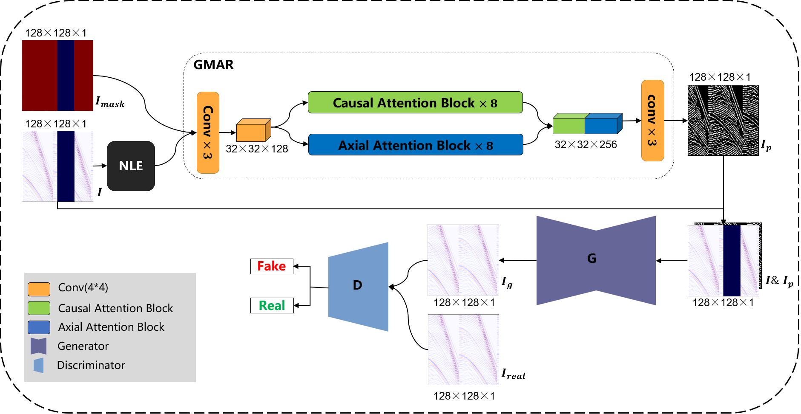
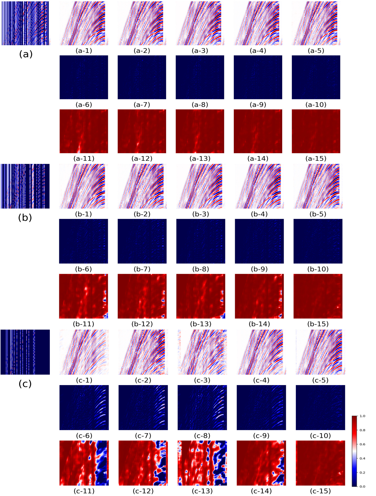
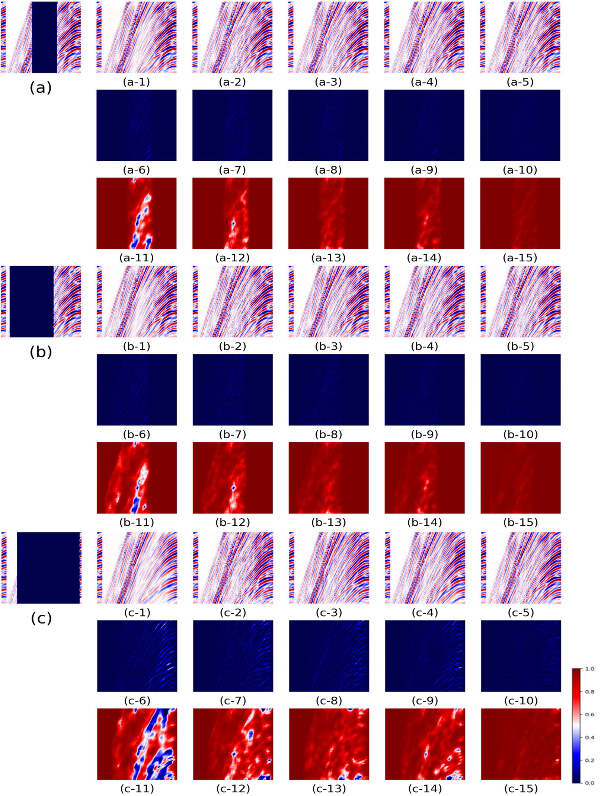

# GNP-WGAN

**GNP-WGAN: Generative Nonlocal A Priori Augmented Wasserstein Generative Adversarial Networks for Seismic Data Reconstruction**

[](https://ieeexplore.ieee.org/document/10604911)
[](https://doi.org/10.1109/TGRS.2024.3431243)

> **Paper**: [GNP-WGAN: Generative Nonlocal A Priori Augmented Wasserstein Generative Adversarial Networks for Seismic Data Reconstruction](https://ieeexplore.ieee.org/document/10604911)  
> **Authors**: Rui Yao, Kewen Li, Yimin Dou, Zhifeng Xu, Mei Wang  
> **Published in**: *IEEE Transactions on Geoscience and Remote Sensing*, vol. 62, pp. 1–12, 2024

## Overview

GNP-WGAN is a two-stage deep learning framework for reconstructing missing or incomplete seismic data. The method leverages **Non-Local Edge (NLE)** structural priors generated by a Transformer-based model (GMAR), which are then used to augment a WGAN-GP for high-quality seismic trace interpolation.

The core idea: rather than directly reconstructing missing seismic traces from incomplete observations alone, we first predict the structural prior information (geological edges) of the missing region, then use this prior to guide the adversarial reconstruction, yielding more geologically consistent results.

## Method

### Architecture

<p align="center">
  
</p>

The framework consists of two stages:

- **Stage 1 — GMAR (upper)**: Takes incomplete seismic data *I_mask* and the corresponding NLE-extracted structure as input. The GMAR module uses dual-branch **Causal Attention Blocks** and **Axial Attention Blocks** (8 each) to predict the full NLE structure prior *I_p* for both observed and missing regions.
- **Stage 2 — GNP-WGAN (lower)**: The incomplete seismic data is combined with the predicted structure prior *I_p*, and fed into the Generator **G** (U-Net) to produce the reconstructed seismic data *I_g*. The PatchGAN Discriminator **D** is trained to distinguish between reconstructed *I_g* and real *I_real* data using WGAN-GP.

### NLE (Non-Local Edge) Extraction

Non-Local Edge features are extracted from seismic data through:
1. Histogram equalization for contrast enhancement
2. Multi-scale gradient computation
3. Non-Maximum Suppression (NMS) for edge thinning
4. Binary thresholding

These NLE features capture the geological structural information (e.g., horizons, faults) of seismic data.

### GMAR (Generative Masked Autoregressive Reconstruction)

A Transformer-based model that predicts NLE structure priors from incomplete seismic data:

- **Input**: 2-channel tensor (masked NLE features + binary mask)
- **Architecture**: Dual-branch attention — **Axial Attention** (row/col decomposed with relative position bias) + **Causal Self-Attention**, outputs concatenated and decoded
- **Output**: Predicted NLE structure map for the full data (including missing regions)
- Position encoding via learnable embeddings

### GNP-WGAN-GP (Generator)

A U-Net architecture with skip connections for seismic reconstruction:

- **Encoder**: 7 downsampling blocks (Conv2d, stride=2) with GroupNorm + SiLU
- **Decoder**: 6 upsampling blocks (ConvTranspose2d, stride=2) with skip connections
- **Output**: Tanh-activated single-channel reconstructed seismic data
- **Input**: Incomplete seismic data with missing regions filled by GMAR-predicted NLE priors

### PatchGAN Discriminator

- 5-layer convolutional discriminator with GroupNorm + SiLU
- Outputs a patch-level realness map instead of a single scalar
- Final activation: Tanh

### Training Strategy

- **Adversarial Loss**: WGAN-GP (Wasserstein distance + Gradient Penalty, λ_gp=10)
- **Reconstruction Loss**: MS-SSIM-L1 composite loss (α=0.16 for MS-SSIM, compensation=200)
- **Generator Loss**: `-E[D(G(x))] + 10 * MS_SSIM_L1(G(x), y)`
- **Critic iterations**: Discriminator updated 5 times per Generator update
- **Optimizer**: AdamW (β₁=0.5, β₂=0.9)
- **Weight Init**: Normal(0, 0.02) for Conv/ConvTranspose, constant for GroupNorm

## Results

### Random Missing Traces

Reconstruction results under random missing trace patterns. Each group shows (from left to right): input with missing traces, reconstruction results from different methods, and the ground truth. The middle rows display the corresponding error maps and SSIM maps.

<p align="center">
  
</p>

### Continuous Missing Traces

Reconstruction results under continuous missing trace patterns (block removal). Each group follows the same layout as above.

<p align="center">
  
</p>

## Project Structure

```
GNP-WGAN/
├── models/
│   ├── GNP_WGAN_GP.py       # Generator (U-Net) & PatchGAN Discriminator
│   ├── GMAR.py               # Transformer model (Axial + Causal Attention)
│   └── NLE.py                # Non-Local Edge extraction
├── dataset/
│   ├── dataset_GNP_WGAN.py   # Dataset for GNP-WGAN (features + structure priors)
│   └── dataset_GMAR.py       # Dataset for GMAR (with on-the-fly NLE extraction)
├── train_GNP_WGAN.py         # Training script for GNP-WGAN
├── test.py                   # Testing & evaluation script
├── config_GNP_WGAN.py        # Hyperparameters for GNP-WGAN
├── config_GMAR.py            # Hyperparameters for GMAR
├── MS_SSIM_L1_loss.py        # Multi-Scale SSIM + L1 composite loss
├── ssim_map.py               # SSIM map computation for visualization
├── requirements.txt          # Python dependencies
└── README.md
```

## Requirements

- Python >= 3.8
- CUDA >= 12.1

Install dependencies:

```bash
pip install -r requirements.txt
```

Key dependencies:
| Package | Version |
|---------|---------|
| PyTorch | 2.1.0+cu121 |
| torchmetrics | 1.2.0 |
| numpy | 1.25.2 |
| scikit-image | latest |
| matplotlib | 3.7.1 |
| opencv-python | 4.7.0.72 |
| scipy | 1.11.2 |
| tqdm | 4.66.1 |

## Data Preparation

Seismic data should be stored as `.npy` files with the following directory structure:

```
data/
└── data_C3/
    ├── features/          # Seismic data patches (.npy files)
    │   ├── feature1.npy
    │   ├── feature2.npy
    │   └── ...
    └── gnp/               # Pre-computed NLE structure priors (.npy files)
        ├── structure1.npy
        ├── structure2.npy
        └── ...
```

- **features/**: Normalized seismic data patches (2D numpy arrays)
- **gnp/**: Corresponding NLE structure prior maps generated by GMAR

### Data Preprocessing

Seismic data is normalized using z-score normalization with σ-clipping (±3.2σ), followed by min-max scaling to [0, 1].

### Missing Trace Simulation

Two types of missing patterns are randomly applied during training:
1. **Random trace removal**: 30%–90% of columns randomly removed
2. **Continuous block removal**: A contiguous block of 30–100 columns removed

## Training

### Stage 1: Train GMAR

Train the GMAR model to predict NLE structure priors from incomplete data. Configure hyperparameters in `config_GMAR.py`:

| Parameter | Default |
|-----------|---------|
| Learning rate | 2e-4 |
| Weight decay | 1e-5 |
| Batch size | 20 |
| Epochs | 500 |

### Stage 2: Train GNP-WGAN

After obtaining the GMAR-predicted structure priors, train the GNP-WGAN:

```bash
python train_GNP_WGAN.py
```

Configure hyperparameters in `config_GNP_WGAN.py`:

| Parameter | Default |
|-----------|---------|
| Generator LR | 2e-4 |
| Discriminator LR | 2e-4 |
| Batch size | 10 |
| Epochs | 500 |

Training logs are saved via TensorBoard. Monitor training with:

```bash
tensorboard --logdir=<log_file_path>
```

Model checkpoints are saved every 5 epochs.

## Testing

```bash
python test.py
```

The test script loads a trained generator checkpoint, performs inference on the validation set, and reports quantitative metrics. It also visualizes results including input, output, target, residual, and SSIM maps using the `seismic` colormap.

Modify the checkpoint path in `test.py`:

```python
model.load_state_dict(torch.load('ckpts/WGAN_generator.pth'))
```

## Evaluation Metrics

| Metric | Description |
|--------|-------------|
| **MSE** | Mean Squared Error between reconstructed and ground truth |
| **PSNR** | Peak Signal-to-Noise Ratio (dB) |
| **SSIM** | Structural Similarity Index |
| **SNR** | Signal-to-Noise Ratio (dB) |

## Citation

If you find this work useful, please cite our paper:

```bibtex
@article{yao2024gnpwgan,
  title={GNP-WGAN: Generative Nonlocal A Priori Augmented Wasserstein Generative Adversarial Networks for Seismic Data Reconstruction},
  author={Yao, Rui and Li, Kewen and Dou, Yimin and Xu, Zhifeng and Wang, Mei},
  journal={IEEE Transactions on Geoscience and Remote Sensing},
  volume={62},
  pages={1--12},
  year={2024},
  publisher={IEEE},
  doi={10.1109/TGRS.2024.3431243}
}
```

## License

This project is for academic research purposes.
